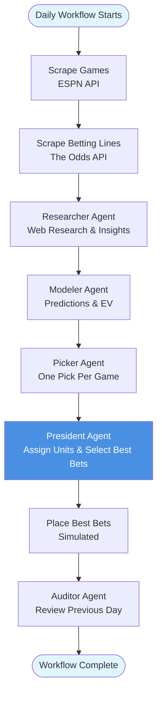

# Terrarium - Sports Gambling Agent System

A multi-agent system for daily sports gambling that uses specialized AI agents to research games, model predictions, select bets, assign units, and track performance.

## Overview

The system consists of 5 specialized agents working together in a coordinated workflow:

- **President**: Assigns betting units, selects up to 5 best bets, and generates comprehensive daily reports
- **Researcher**: Data gathering and game insights with web browsing capabilities
- **Modeler**: Predictive modeling and EV calculations
- **Picker**: Makes exactly one pick per game with detailed reasoning
- **Auditor**: Performance tracking and daily reports

## Workflow Diagram



## Features

- **Real-time Game Scraping**: Uses ESPN API to fetch NCAA basketball games
- **Betting Lines**: Real betting lines via The Odds API (with mock data fallback)
- **Web Browsing**: Researcher agent can search the web for injury reports, stats, and news
- **Multi-Agent System**: 5 specialized LLM-powered agents working together
- **Comprehensive Logging**: Detailed logs of all agent interactions
- **Unit Assignment**: President assigns decimal betting units (0.5, 1.0, 2.5, etc.) to each pick
- **Best Bet Selection**: President selects up to 5 best bets from all picks
- **Performance Tracking**: Daily reports with insights and recommendations
- **Model Optimization**: Different OpenAI models per agent for cost efficiency
- **One Pick Per Game**: Picker makes exactly one pick per game with detailed reasoning
- **Batch Processing**: Efficient processing of games in batches with retry logic
- **Caching**: Smart caching for betting lines (1 hour) and research (24 hours)
- **Google Sheets Integration**: Automatically export picks and results to Google Sheets
- **Email Notifications**: Daily email summaries of picks and best bets

## Prerequisites

- Python 3.11 or higher
- pip (Python package manager)
- OpenAI API key (for LLM agents)
- The Odds API key (optional, for real betting lines)
- Google Cloud Project credentials (optional, for Google Sheets)

## Getting Started

### 1. Installation

Clone the repository and install dependencies:

```bash
# Clone the repository
git clone https://github.com/yourusername/terrarium.git
cd terrarium

# Create virtual environment
python -m venv venv
source venv/bin/activate  # On Windows: venv\Scripts\activate

# Install dependencies
pip install -r requirements.txt
```

### 2. Configuration

Create a `.env` file in the project root:

```bash
touch .env
```

Add your API keys to `.env`:

```bash
# OpenAI API (required)
OPENAI_API_KEY=your_openai_api_key_here

# Betting Lines API (optional - for real betting lines)
THE_ODDS_API_KEY=your_odds_api_key_here

# Database (optional - defaults to SQLite in data/db/)
DATABASE_URL=sqlite:///data/db/terrarium.db

# Logging (optional)
LOG_LEVEL=INFO
```

### 3. Run Your First Pipeline

Run the pipeline for today's games (manual execution):

```bash
python -m src.main --once
```

This will:
1. Scrape today's games
2. Research teams and injuries
3. Run predictive models
4. Generate picks
5. Create a betting card

### 4. Advanced Setup (Optional)

- **Google Sheets**: Follow [GOOGLE_SHEETS_SETUP.md](GOOGLE_SHEETS_SETUP.md) to track results automatically.
- **Email Notifications**: Follow [EMAIL_SETUP.md](EMAIL_SETUP.md) to receive daily emails.

## Running the Pipeline

### Manual Execution

Run the pipeline once for today's date:
```bash
python -m src.main --once
```

Run for a specific date:
```bash
python -m src.main --once --date 2025-01-15
```

Run in test mode (processes only first 5 games by default):
```bash
python -m src.main --once --test
```

Run in test mode with custom number of games:
```bash
python -m src.main --once --test 10
```

Force refresh of cached data:
```bash
python -m src.main --once --force-refresh
```

Run for a single specific game ID (useful for debugging):
```bash
python -m src.main --once --game-id 12345
```

Enable debug logging:
```bash
python -m src.main --once --debug
```

### Scheduled Daily Runs

Run as a scheduled daemon that executes daily at the configured time:
```bash
python -m src.main --schedule
```

The scheduler will run at the time specified in `config/config.yaml` (default: 9:00 AM Eastern Time).

**Note**: The scheduler runs continuously. To stop it, press `Ctrl+C`.

### Generating Emails Manually

You can generate and send the daily email manually:

```bash
python scripts/generate_email.py --send
```

See [EMAIL_SETUP.md](EMAIL_SETUP.md) for more details.

## Configuration

### Agent Settings

Configuration is managed in `config/config.yaml`:

```yaml
agents:
  researcher:
    enabled: true
  modeler:
    batch_size: 5  # Process 5 games per batch
  picker:
    batch_size: 12  # Process 12 games per batch
  auditor:
    enabled: true
  president:
    enabled: true
```

### LLM Model Configuration

The system uses optimized models per agent for cost efficiency (configurable in `config.yaml`):

```yaml
llm:
  model: "gpt-5-mini"  # Default model
  
  agent_models:
    president: "gpt-5.1"     # High reasoning capability
    modeler: "gpt-5.1"       # Strong math/logic capability
    researcher: "gpt-4o-mini"# Efficient for many tool calls
    picker: "gpt-5-mini"     # Standard reasoning
    auditor: "gpt-4o-mini"   # Summarization focus
```

### Email Configuration

```yaml
email:
  smtp_server: "smtp.gmail.com"
  smtp_port: 587
  use_tls: true
  sender_name: "Terrarium Betting"
```

## Agent Output Examples

### Researcher Agent
The Researcher gathers comprehensive game insights including advanced stats, injuries, and expert predictions.

### Modeler Agent
The Modeler generates predictions, probabilities, and edge estimates for each game.

### Picker Agent
The Picker makes exactly one pick per game, choosing the best bet type (spread, total, or moneyline) with detailed reasoning.

### President Agent
The President assigns betting units to each pick, selects up to 5 best bets, and generates a comprehensive daily report.

### Auditor Agent
The Auditor reviews previous day's results and generates performance insights.

*(See full examples in previous documentation or run the pipeline to generate your own)*

## Real Betting Lines Setup

To get real betting lines instead of mock data:

1. **Sign up for The Odds API** (free tier available at [the-odds-api.com](https://the-odds-api.com/)).
2. **Add API key to `.env`**: `THE_ODDS_API_KEY=your_api_key_here`
3. **Run the pipeline**: `python -m src.main --once`

The system will automatically use real lines from DraftKings (configurable) and cache results for 1 hour.

## Project Structure

```
terrarium/
├── config/              # Configuration files
│   └── config.yaml
├── data/                # Data storage
│   ├── cache/           # Cache files (lines, research)
│   ├── db/              # Database files (SQLite)
│   ├── logs/            # Log files
│   └── reports/         # Generated reports
├── scripts/             # Utility and maintenance scripts
│   ├── generate_email.py
│   └── ...
├── src/
│   ├── agents/          # Agent implementations
│   │   ├── researcher/
│   │   ├── modeler.py
│   │   ├── picker.py
│   │   ├── president.py
│   │   ├── auditor.py
│   │   └── results_processor.py
│   ├── data/            # Data models and scrapers
│   │   ├── models.py
│   │   ├── storage.py
│   │   └── scrapers/
│   ├── models/          # Predictive models (Kelly, etc.)
│   ├── orchestration/   # Workflow coordination
│   │   ├── coordinator.py
│   │   └── ...
│   ├── prompts/         # Agent system prompts
│   └── utils/           # Utilities
│       ├── email/
│       ├── google_sheets.py
│       ├── llm.py
│       ├── logging.py
│       └── web_browser.py
└── tests/               # Test files
```

## Troubleshooting

### Google Sheets Issues
- Ensure `GOOGLE_SHEETS_CREDENTIALS_PATH` is set.
- Share the sheet with the service account email.
- See [GOOGLE_SHEETS_SETUP.md](GOOGLE_SHEETS_SETUP.md).

### Email Issues
- Use an App Password for Gmail.
- Check `EMAIL_SENDER` and `EMAIL_PASSWORD` env vars.
- See [EMAIL_SETUP.md](EMAIL_SETUP.md).

### OpenAI API Errors
- Check Quota/Billing on OpenAI platform.
- Verify `OPENAI_API_KEY` is correct.

## License

MIT License - see LICENSE file for details
