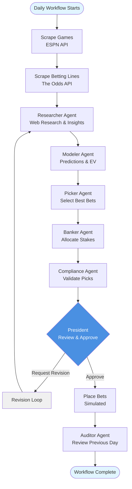

# Terrarium - Sports Gambling Agent System

A multi-agent system for daily sports gambling that uses specialized AI agents to research games, model predictions, select bets, manage bankroll, and track performance.

## Overview

The system consists of 7 specialized agents working together in a coordinated workflow:

- **President**: Executive lead, final approval, can request revisions (uses `gpt-5.1` for best reasoning)
- **Researcher**: Data gathering and game insights with web browsing capabilities
- **Modeler**: Predictive modeling and EV calculations
- **Picker**: Bet selection (supports parlays)
- **Banker**: Bankroll management (Kelly criterion, dynamic exposure)
- **Compliance**: Validation and sanity checks
- **Auditor**: Performance tracking and daily reports

## Workflow Diagram



## Features

- **Real-time Game Scraping**: Uses ESPN API to fetch NCAA basketball games
- **Betting Lines**: Real betting lines via The Odds API (with mock data fallback)
- **Web Browsing**: Researcher agent can search the web for injury reports, stats, and news
- **Multi-Agent System**: 7 specialized LLM-powered agents working together
- **Revision Loop**: President can request revisions from other agents
- **Comprehensive Logging**: Detailed logs of all agent interactions
- **Bankroll Management**: Kelly criterion and dynamic risk management
- **Performance Tracking**: Daily reports with insights and recommendations
- **Model Optimization**: Different OpenAI models per agent for cost efficiency
- **Parlay Support**: Occasional parlay betting for entertainment
- **Batch Processing**: Efficient processing of games in batches with retry logic
- **Caching**: Smart caching for betting lines (1 hour) and research (24 hours)

## Agent Output Examples

### Researcher Agent

The Researcher gathers comprehensive game insights including advanced stats, injuries, and expert predictions.

**Example Output:**
```json
{
  "games": [
    {
      "game_id": "10",
      "teams": {
        "away": "App State Mountaineers",
        "home": "Dartmouth Big Green"
      },
      "market": {
        "spread": "App State +3.5",
        "total": 145.5,
        "moneyline": {
          "away": "+150",
          "home": "-170"
        }
      },
      "advanced_stats": {
        "away_team": {
          "adjo": 115.2,
          "adjd": 98.5,
          "adjt": 68.3,
          "kenpom_rank": 45
        },
        "home_team": {
          "adjo": 108.5,
          "adjd": 102.3,
          "adjt": 65.1,
          "kenpom_rank": 78
        },
        "matchup_analysis": [
          "App State has significant offensive advantage (AdjO 115.2 vs AdjD 102.3 = +12.9 advantage)",
          "Dartmouth has slight defensive advantage (AdjD 98.5 vs AdjO 108.5 = +10.0 advantage)"
        ]
      },
      "key_injuries": [
        {
          "team": "App State",
          "player": "John Smith",
          "position": "PG",
          "status": "Questionable",
          "impact": "High - starting point guard, 15 PPG, 8 APG"
        }
      ],
      "recent_form_summary": "App State: 2-2 in last 4, averaging 72.5 PPG. Dartmouth: 0-2 in last 2, averaging 60.0 PPG.",
      "expert_predictions_summary": "Consensus: 4 of 6 experts favor App State +3.5. 3 of 5 favor Over 145.5.",
      "common_opponents_analysis": [
        "Both teams played Team X: App State won 85-72 (+13), Dartmouth lost 68-75 (-7). Net advantage: +20 points to App State."
      ],
      "notable_context": [
        "Travel: App State traveling 300 miles, 2nd game in 3 days",
        "Rivalry: Historic matchup, App State leads series 12-8"
      ]
    }
  ]
}
```

### Modeler Agent

The Modeler generates predictions, probabilities, and edge estimates for each game.

**Example Output:**
```json
{
  "game_models": [
    {
      "game_id": "10",
      "predictions": {
        "spread": {
          "projected_line": "App State -1.0",
          "projected_margin": -1.0,
          "model_confidence": 0.75
        },
        "total": {
          "projected_total": 144.0,
          "model_confidence": 0.70
        },
        "moneyline": {
          "team_probabilities": {
            "away": 0.45,
            "home": 0.55
          },
          "model_confidence": 0.80
        }
      },
      "market_edges": [
        {
          "market_type": "spread",
          "market_line": "App State +3.5 -110",
          "model_estimated_probability": 0.55,
          "implied_probability": 0.29,
          "edge": 0.26,
          "edge_confidence": 0.75
        },
        {
          "market_type": "total",
          "market_line": "145.5 -110",
          "model_estimated_probability": 0.60,
          "implied_probability": 0.50,
          "edge": 0.10,
          "edge_confidence": 0.70
        }
      ],
      "model_notes": "App State's offensive efficiency gives them a slight edge. Confidence is moderate due to matchup dynamics."
    }
  ]
}
```

### Picker Agent

The Picker selects the best betting opportunities based on edge and confidence.

**Example Output:**
```json
{
  "candidate_picks": [
    {
      "game_id": "10",
      "bet_type": "spread",
      "selection": "App State +3.5",
      "odds": "-110",
      "justification": [
        "Strong edge: 26% positive EV (model prob 55% vs implied 29%)",
        "Advanced stats favor App State (AdjO advantage +12.9)",
        "Expert consensus: 4 of 6 favor App State +3.5"
      ],
      "edge_estimate": 0.26,
      "confidence": 0.75,
      "favorite": true,
      "confidence_score": 8
    },
    {
      "game_id": "10",
      "bet_type": "total",
      "selection": "Over 145.5",
      "odds": "-110",
      "justification": [
        "Moderate edge: 10% positive EV",
        "Both teams play at faster pace (AdjT 68.3 vs 65.1)"
      ],
      "edge_estimate": 0.10,
      "confidence": 0.70,
      "favorite": false,
      "confidence_score": 6
    }
  ],
  "overall_strategy_summary": [
    "Focusing on spread bets with strong edge (26%+)",
    "Avoiding low-confidence plays (<60% confidence)"
  ]
}
```

### Banker Agent

The Banker allocates stakes using fractional Kelly criterion.

**Example Output:**
```json
{
  "bankroll_status": {
    "current_bankroll": 100.0,
    "base_unit_size": 1.0,
    "risk_mode": "normal",
    "notes": "Bankroll healthy, using standard sizing"
  },
  "sized_picks": [
    {
      "game_id": "10",
      "bet_type": "spread",
      "selection": "App State +3.5",
      "odds": "-110",
      "edge_estimate": 0.26,
      "confidence": 0.75,
      "units": 2.0,
      "stake_rationale": [
        "High edge (26%) with good confidence (75%)",
        "Fractional Kelly suggests 2.0 units",
        "Within daily exposure limits"
      ],
      "risk_flags": []
    }
  ],
  "total_daily_exposure_summary": {
    "num_bets": 5,
    "total_units_risked": 11.0,
    "concentration_notes": "Well-diversified across 5 games"
  }
}
```

### Compliance Agent

The Compliance agent validates picks for quality and risk.

**Example Output:**
```json
{
  "bet_reviews": [
    {
      "game_id": "10",
      "selection": "App State +3.5",
      "odds": "-110",
      "units": 2.0,
      "compliance_status": "approved",
      "issues": [],
      "recommendations": []
    },
    {
      "game_id": "15",
      "selection": "Team X -15.5",
      "odds": "-110",
      "units": 5.0,
      "compliance_status": "approved_with_warning",
      "issues": [
        "High stake size (5 units) relative to bankroll",
        "Large spread may indicate overconfidence"
      ],
      "recommendations": [
        "Consider reducing stake to 3 units",
        "Verify model confidence is justified"
      ]
    }
  ],
  "global_risk_assessment": [
    "Overall risk posture: Conservative",
    "No correlated bets detected",
    "Daily exposure within limits"
  ]
}
```

### President Agent

The President reviews and approves the final betting card.

**Example Output:**
```json
{
  "approved_picks": [
    {
      "game_id": "10",
      "bet_type": "spread",
      "selection": "App State +3.5",
      "odds": "-110",
      "edge_estimate": 0.26,
      "units": 2.0,
      "final_decision_reasoning": "Strong edge with solid research backing. Model confidence is high and expert consensus supports this pick."
    }
  ],
  "rejected_picks": [
    {
      "game_id": "15",
      "reason_rejected": "Stake size too large relative to edge. Compliance warning indicates overconfidence. Recommend reducing stake before approval."
    }
  ],
  "revision_requests": [],
  "high_level_strategy_notes": [
    "Focusing on quality over quantity - 5 high-confidence picks",
    "Maintaining conservative bankroll management",
    "Avoiding correlated exposures"
  ]
}
```

### Auditor Agent

The Auditor reviews previous day's results and generates performance insights.

**Example Output:**
```json
{
  "period_summary": {
    "start_date": "2025-11-15",
    "end_date": "2025-11-15",
    "num_bets": 5,
    "units_won_or_lost": 2.5,
    "roi": 0.25,
    "hit_rate": 0.60,
    "max_drawdown_units": 0.0,
    "notes": "Profitable day with strong win rate"
  },
  "bet_level_analysis": [
    {
      "game_id": "10",
      "selection": "App State +3.5",
      "odds": "-110",
      "units": 2.0,
      "result": "win",
      "units_result": 1.82,
      "edge_estimate": 0.26,
      "confidence": 0.75,
      "was_result_consistent_with_model": true,
      "post_hoc_notes": "Model correctly identified edge. Pick performed as expected."
    }
  ],
  "diagnostics_and_recommendations": {
    "modeler": [
      "Model calibration is accurate - high confidence picks performing well",
      "Continue using advanced stats for edge calculation"
    ],
    "picker": [
      "Good selection of high-edge opportunities",
      "Consider being more selective on lower-confidence plays"
    ],
    "banker": [
      "Stake sizing is appropriate",
      "No adjustments needed to Kelly fraction"
    ],
    "president": [
      "Approval process working well",
      "Continue rejecting low-quality picks"
    ]
  }
}
```

## Prerequisites

- Python 3.11 or higher
- pip (Python package manager)
- OpenAI API key (for LLM agents)
- The Odds API key (optional, for real betting lines)

## Installation

1. **Clone the repository** (if applicable) or navigate to the project directory:
```bash
cd /path/to/terrarium
```

2. **Create a virtual environment** (recommended):
```bash
python -m venv venv
source venv/bin/activate  # On Windows: venv\Scripts\activate
```

3. **Install dependencies**:
```bash
pip install -r requirements.txt
```

4. **Set up environment variables**:
```bash
# Create .env file
touch .env
```

5. **Edit `.env` file**:
```bash
# OpenAI API (required)
OPENAI_API_KEY=your_openai_api_key_here

# Betting Lines API (optional - for real betting lines)
THE_ODDS_API_KEY=your_odds_api_key_here

# Database (optional)
DATABASE_URL=sqlite:///data/db/terrarium.db

# Logging (optional)
LOG_LEVEL=INFO
```

6. **Configure settings** in `config/config.yaml`:
   - Bankroll settings (initial balance, min balance)
   - Betting thresholds (min EV, max confidence)
   - Agent configurations
   - LLM model assignments
   - Scheduler settings

## Running the Pipeline

### Option 1: Run Once (Manual Execution)

Run the pipeline once for today's date:
```bash
python -m src.main --once
```

Run for a specific date:
```bash
python -m src.main --once --date 2025-01-15
```

Run in test mode (processes only first 5 games):
```bash
python -m src.main --once --test
```

Force refresh of cached data:
```bash
python -m src.main --once --force-refresh
```

### Option 2: Scheduled Daily Runs

Run as a scheduled daemon that executes daily at the configured time:
```bash
python -m src.main --schedule
```

The scheduler will run at the time specified in `config/config.yaml` (default: 9:00 AM Eastern Time).

**Note**: The scheduler runs continuously. To stop it, press `Ctrl+C`.

### Option 3: Python Script

You can also import and use the coordinator directly:

```python
from src.orchestration.coordinator import Coordinator
from datetime import date

# Initialize coordinator
coordinator = Coordinator()

# Run workflow for today
review = coordinator.run_daily_workflow()

# Run workflow for specific date
review = coordinator.run_daily_workflow(date(2025, 1, 15))

# Run in test mode
review = coordinator.run_daily_workflow(test_mode=True)

# Check results
print(f"Card approved: {review.approved}")
print(f"Picks approved: {len(review.picks_approved)}")
print(f"Revision requests: {len(review.revision_requests)}")

# Clean up
coordinator.close()
```

## Pipeline Workflow

The daily workflow follows these steps:

1. **Scrape Games**: Fetches NCAA basketball games from ESPN API
2. **Scrape Betting Lines**: Gets betting lines from configured sources (The Odds API or mock data)
3. **Research**: Researcher gathers insights, stats, and injury reports (with web browsing)
4. **Model**: Modeler generates predictions and EV estimates (batch processing)
5. **Select**: Picker chooses highest-EV bets (may create parlays)
6. **Allocate**: Banker assigns stakes using Kelly criterion (dynamic max exposure)
7. **Validate**: Compliance checks picks for quality and risk
8. **Review**: President reviews and approves/rejects card
9. **Revise** (if needed): If President requests revisions, workflow loops back
10. **Place Bets**: Approved picks are placed (simulated)
11. **Track**: Results are tracked for future analysis
12. **Report**: Auditor generates daily performance report

## Configuration

### Bankroll Settings (`config/config.yaml`)

```yaml
bankroll:
  initial: 100.0        # Starting bankroll
  min_balance: 10.0     # Stop betting if below this (10% of initial)
  # max_daily_exposure is calculated dynamically by Banker agent
```

### Betting Settings

```yaml
betting:
  min_ev: 0.05           # Minimum expected value to consider
  max_confidence: 0.85   # Reject overconfident picks
  kelly_fraction: 0.25    # Fractional Kelly (25% of full Kelly)
```

### Agent Settings

```yaml
agents:
  researcher:
    enabled: true
  modeler:
    model_type: "simple_linear"
  picker:
    max_picks_per_day: 10
    parlay_enabled: true
    parlay_probability: 0.15  # 15% chance to create a parlay
    parlay_min_legs: 2
    parlay_max_legs: 4
    parlay_min_confidence: 0.65
  banker:
    strategy: "fractional_kelly"  # or "flat"
  compliance:
    enabled: true
  auditor:
    enabled: true
  president:
    enabled: true
```

### LLM Model Configuration

The system uses optimized models per agent for cost efficiency:

```yaml
llm:
  # Default model (used if agent-specific model not specified)
  model: "gpt-5-mini"
  temperature_default: 0.7
  
  # Per-agent model optimization
  agent_models:
    president: "gpt-5.1"        # Best reasoning for critical decisions
    researcher: "gpt-5-mini"    # Many calls, needs efficiency
    modeler: "gpt-5-mini"       # Per game, math in code
    picker: "gpt-5-mini"        # Filters edges
    banker: "gpt-5-mini"        # Risk management
    compliance: "gpt-5-nano"   # Rule checking
    auditor: "gpt-5-nano"       # Summarization
```

**Note**: GPT-5 models don't support the `temperature` parameter, so it's automatically omitted for those models.

### Scheduler Settings

```yaml
scheduler:
  run_time: "09:00"      # Daily run time (24-hour format)
  timezone: "America/New_York"
```

## LLM-Centric Architecture

The system uses OpenAI's API for all agent logic. Each agent has:
- **System Prompt**: Defined in `src/prompts.py` - describes role and responsibilities
- **LLM Client**: Handles API calls, JSON parsing, error handling
- **Function Calling**: Researcher agent can use web browsing tools
- **Structured Output**: Agents return JSON dictionaries
- **Batch Processing**: Efficient processing of games in batches (Researcher: 5 games, Modeler: 3 games)

### Web Browsing (Researcher Agent)

The Researcher agent has access to web browsing tools:
- `search_web(query)`: General web search
- `search_injury_reports(team_name)`: Search for injury reports
- `search_team_stats(team_name)`: Search for team statistics
- `search_game_predictions(team1, team2, game_date)`: Search for expert predictions
- `fetch_url(url)`: Read content from URLs

The agent automatically uses these tools to gather real-time information when researching games.

## Real Betting Lines Setup

To get real betting lines instead of mock data:

1. **Sign up for The Odds API** (free tier available):
   - Visit [the-odds-api.com](https://the-odds-api.com/)
   - Free tier: 500 requests/month (sufficient for daily runs)
   - Get your API key from the dashboard

2. **Add API key to `.env`**:
   ```bash
   THE_ODDS_API_KEY=your_api_key_here
   ```

3. **Run the pipeline** - it will automatically use real lines:
   ```bash
   python -m src.main --once
   ```

The system will:
- Fetch real lines from DraftKings (configurable)
- Automatically fall back to mock data if API is unavailable
- Cache results for 1 hour to reduce API calls

**Rate Limiting**: Free tier allows 500 requests/month. The system makes ~1 request per sportsbook per day, so this is sufficient for daily runs.

## Caching

The system uses smart caching to reduce API calls and improve performance:

- **Betting Lines Cache**: 1 hour TTL (stored in `data/cache/lines_cache.json`)
- **Researcher Cache**: 24 hour TTL (stored in `data/cache/researcher_cache.json`)

To bypass cache and force fresh data:
```bash
python -m src.main --once --force-refresh
```

## Logging

Logs are written to:
- **Console**: Formatted output with agent interactions
- **File**: `data/logs/terrarium.log` (rotating, max 10MB, 5 backups)
- **Agent Reports**: Individual reports saved to `data/reports/{agent_name}/`

### Log Levels

Set in `.env`:
- `DEBUG`: Detailed debugging information
- `INFO`: General information (default)
- `WARNING`: Warnings and revision requests
- `ERROR`: Errors only

### Understanding Logs

The logs show:
- **🔄 HANDOFF**: Data passed between agents
- **▶️ AGENT START**: Agent begins processing
- **✅ AGENT COMPLETE**: Agent finishes with summary
- **🔁 REVISION REQUEST**: President requests revision
- **🎯 DECISION**: Agent makes a decision
- **🌐 Web search**: Researcher searching the web
- **💰**: Token usage and costs
- **❌**: Errors or rejections

Example log output:
```
2025-01-15 09:00:00 | agents.researcher | INFO | ▶️  AGENT START: Researcher | Researching 12 games
2025-01-15 09:00:02 | agents.researcher | INFO | 🌐 Web search: Duke basketball injury report
2025-01-15 09:00:05 | agents.researcher | INFO | ✅ AGENT COMPLETE: Researcher | Generated 12 insights
2025-01-15 09:00:05 | agents.modeler    | INFO | 🔄 HANDOFF: Researcher → Modeler | Type: GameInsights | Count: 12
```

## Reports

### Daily Performance Reports

The Auditor agent automatically reviews previous day's results and generates comprehensive daily reports. These reports include:

- **Performance Summary**: Wins, losses, win rate, P&L, ROI
- **What Went Well**: Successful strategies and winning patterns
- **What Needs Improvement**: Areas where performance was weak
- **Key Findings**: Best/worst bet types, confidence accuracy, parlay performance
- **Actionable Recommendations**: Specific steps to improve performance

Reports are automatically:
- Generated each day after the workflow completes
- Saved to `data/reports/daily_report_YYYY-MM-DD.txt`
- Stored in the database for historical analysis

### Agent Reports

Each agent generates a detailed report saved to `data/reports/{agent_name}/{agent_name}_YYYY-MM-DD.txt`:

- **Researcher**: Game insights, advanced stats, injuries
- **Modeler**: Predictions, edge estimates, confidence scores
- **Picker**: Selected picks with rationale
- **Banker**: Stake allocations and risk assessment
- **Compliance**: Validation results
- **President**: Approval decisions and strategic notes
- **Auditor**: Performance analysis and recommendations

### Betting Card

A simple betting card is generated for manual review:
- Saved to `data/reports/betting_card_YYYY-MM-DD.txt`
- Shows favorite picks (with stakes) and other picks (for reference)
- Includes confidence scores and rationale

### President's Report

A comprehensive report from the President:
- Saved to `data/reports/president/presidents_report_YYYY-MM-DD.txt`
- Includes approved picks with full rationale
- Shows rejected picks with rejection reasons
- Provides strategic overview

### Accessing Reports

**View latest report:**
```python
from src.utils.reporting import ReportGenerator
from src.data.storage import Database
from datetime import date

db = Database()
generator = ReportGenerator(db)

# Get today's report (reviews yesterday's results)
report_text = generator.generate_daily_report()
print(report_text)

# Get report for specific date
report_text = generator.generate_daily_report(date(2025, 1, 15))
print(report_text)
```

**View saved report file:**
```bash
cat data/reports/daily_report_2025-01-15.txt
cat data/reports/betting_card_2025-01-15.txt
cat data/reports/president/presidents_report_2025-01-15.txt
```

## Revision System

The President agent can request revisions from other agents if quality thresholds aren't met:

- **Research Revisions**: Requested if >30% of games have low data quality
- **Modeling Revisions**: Requested if >40% of predictions have low confidence
- **Selection Revisions**: Requested if >50% of picks have low EV
- **Validation Revisions**: Requested if >50% rejection rate

The coordinator automatically loops back up to 2 times (configurable) to process revisions.

## Database

The system uses SQLite by default (configurable to PostgreSQL). Database file location:
- Default: `data/db/terrarium.db`

### Viewing Data

You can query the database directly or use SQLite command line:

```bash
sqlite3 data/db/terrarium.db

# View recent picks
SELECT * FROM picks ORDER BY created_at DESC LIMIT 10;

# View daily reports
SELECT * FROM daily_reports ORDER BY date DESC;

# View bankroll history
SELECT * FROM bankroll_history ORDER BY date DESC;
```

## Troubleshooting

### No Games Found

If no games are found:
- Check your internet connection
- Verify ESPN API is accessible
- Check the date (games may not be scheduled)
- Review logs for API errors

### Database Errors

If you encounter database errors:
- Ensure `data/db/` directory exists
- Check file permissions
- Verify SQLite is installed
- Review database URL in `.env`

### Import Errors

If you get import errors:
- Ensure virtual environment is activated
- Verify all dependencies are installed: `pip install -r requirements.txt`
- Check Python version: `python --version` (should be 3.11+)

### OpenAI API Errors

**"insufficient_quota" error**:
- Your OpenAI API account has no credits or exceeded usage limits
- ChatGPT Plus subscription does NOT include API access
- Add payment method and purchase API credits at https://platform.openai.com/account/billing

**"rate_limit" error**:
- Too many requests - wait a moment and retry
- Consider upgrading your OpenAI plan

**Model not found errors**:
- Verify the model name exists in your OpenAI account
- Check that you have access to the model (some models require special access)

### Logging Issues

If logs aren't appearing:
- Check `data/logs/` directory exists
- Verify `LOG_LEVEL` in `.env`
- Check file permissions
- Review log file path in configuration

### Betting Lines Issues

**"The Odds API not configured"**:
- Add `THE_ODDS_API_KEY` to your `.env` file
- System will fall back to mock data automatically

**"No lines found in API response"**:
- Game may not yet be available in API (check game date)
- Team name mismatch (check logs)
- System will fall back to mock data automatically

## Development

### Project Structure

```
terrarium/
├── src/
│   ├── agents/          # Agent implementations
│   │   ├── researcher.py
│   │   ├── modeler.py
│   │   ├── picker.py
│   │   ├── banker.py
│   │   ├── compliance.py
│   │   ├── president.py
│   │   └── auditor.py
│   ├── data/            # Data models and scrapers
│   │   ├── models.py
│   │   ├── storage.py
│   │   └── scrapers/
│   ├── orchestration/   # Workflow coordination
│   │   └── coordinator.py
│   ├── prompts.py       # Agent system prompts
│   └── utils/           # Utilities (logging, config, LLM)
│       ├── logging.py
│       ├── config.py
│       ├── llm.py
│       └── web_browser.py
├── config/              # Configuration files
│   └── config.yaml
├── data/                # Data storage
│   ├── db/              # Database files
│   ├── logs/            # Log files
│   ├── cache/           # Cache files
│   └── reports/         # Generated reports
│       ├── researcher/
│       ├── modeler/
│       ├── picker/
│       ├── banker/
│       ├── compliance/
│       ├── president/
│       └── auditor/
└── tests/               # Test files
```

### Running Tests

```bash
# Run all tests
pytest tests/

# Run specific test file
pytest tests/test_agents.py

# Run with coverage
pytest --cov=src tests/
```

## License

MIT License - see LICENSE file for details

## Support

For issues or questions:
1. Check the logs in `data/logs/terrarium.log`
2. Review configuration in `config/config.yaml`
3. Check database for data issues
4. Review agent interaction logs for workflow problems
5. Check agent reports in `data/reports/` for detailed output

## Next Steps

After running the pipeline:
1. Review daily reports to assess performance
2. Adjust configuration based on results
3. Monitor bankroll health
4. Review revision requests to improve agent performance
5. Analyze long-term trends using summary reports
6. Check individual agent reports for detailed insights
